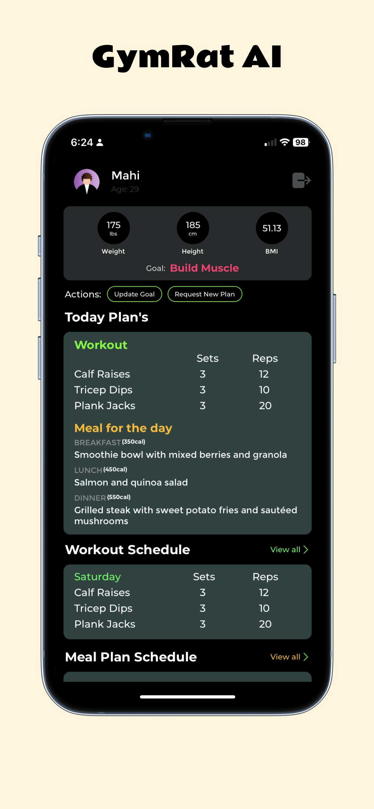
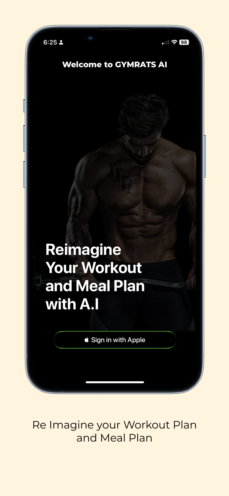
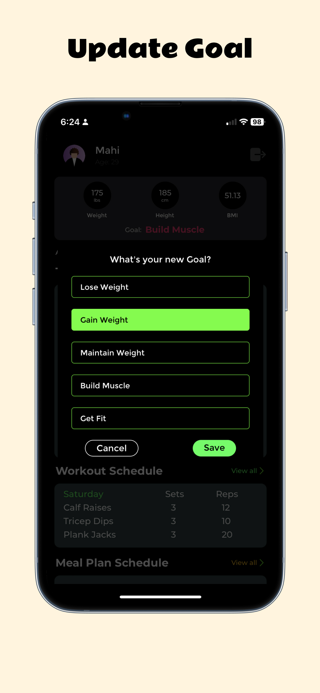

    

<h1 align="center">Gymrat AI</h1>

## Features

- Get your Personalised Workout Plan and Meal Plan based on your body metrics and goal.
- Sign In/Sign Up with Apple

## Upcoming Features

- Track your progress
- Import your Apple Health Data

## Screenshots

    
    
    

## Tech Stack

- React Native and Expo : `mobile`
- TypeScript : `mobile`, `web`, `backend`
- NextJS : `web`
- AWS Lambda : `backend`
